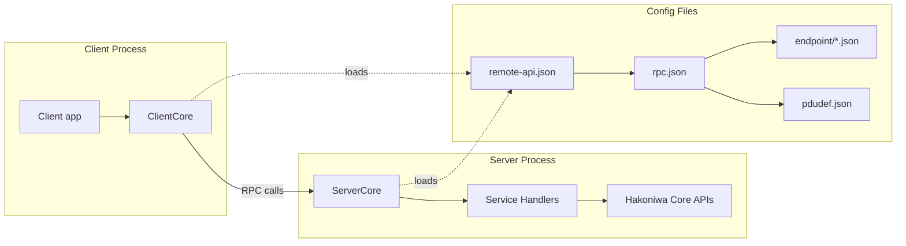

# hakoniwa-remote-api
Transport-agnostic remote API for operating Hakoniwa worlds, assets, and runtimes from external processes.

## Architecture

The Remote API exposes a small RPC surface area that clients use to join a Hakoniwa simulation, query state, control the simulation, and acknowledge events. Configuration is provided via `remote-api.json`, which points to the RPC service definition and endpoint details.



## RPC API specification (5 services)

All RPC services are declared in `config/sample/rpc/rpc.json` and implemented by the server handlers in `src/server/concrete_service_handler.cpp`.

| Service | Purpose | Request | Response |
| --- | --- | --- | --- |
| `HakoRemoteApi/Join` | Register a client with the server. | `name` (client node ID) | `status_code`, `message` |
| `HakoRemoteApi/GetSimState` | Retrieve the current simulation state. | `name` (client node ID) | `sim_state`, `master_time`, `is_pdu_created`, `is_simulation_mode`, `is_pdu_sync_mode` |
| `HakoRemoteApi/SimControl` | Start/stop/reset the simulation. | `name`, `op` (`HakoSimulationControlCommand`) | `status_code`, `message` |
| `HakoRemoteApi/GetEvent` | Get the next pending event for the client. | `name` | `event_code` |
| `HakoRemoteApi/AckEvent` | Acknowledge an event after handling. | `name`, `event_code`, `result_code` | `status_code` |

### RPC result codes

Responses use `hakoniwa::pdu::rpc::HAKO_SERVICE_RESULT_CODE_*` to report success, invalid requests, or internal errors. The server validates the client name before processing requests.

## Server API specification

The server-facing public API is exposed via `hakoniwa::api::ServerCore`.

- `ServerCore(std::string config_path, std::string node_id, bool enable_conductor = false)`
  - Loads configuration from `remote-api.json` and binds to the specified server node ID.
- `bool initialize()`
  - Parses configuration, validates server/client pairing, and initializes RPC services.
- `bool start()`
  - Starts RPC services and spawns worker threads.
- `bool stop()`
  - Stops RPC services and joins worker threads (idempotent).
- `bool is_running() const`
  - Reports whether the server is running.
- `std::string last_error() const`
  - Returns the last error message.

## Client API specification

The client-facing public API is exposed via `hakoniwa::api::ClientCore`.

- `ClientCore(std::string node_id, std::string config_path)`
  - Loads configuration and binds to the specified client node ID.
- `bool initialize()`
  - Parses configuration and initializes the RPC client.
- `bool start()` / `bool stop()`
  - Starts or stops RPC services.
- `bool is_pdu_end_point_running()`
  - Returns whether the client endpoint is available.
- `bool join()`
  - Calls `HakoRemoteApi/Join`.
- `bool get_sim_state(HakoSimulationStateInfo &state)`
  - Calls `HakoRemoteApi/GetSimState`.
- `bool sim_control(HakoSimulationControlCommand command)`
  - Calls `HakoRemoteApi/SimControl`.
- `bool get_event(HakoSimulationAssetEvent &event)`
  - Calls `HakoRemoteApi/GetEvent`.
- `bool ack_event(HakoSimulationAssetEvent event)`
  - Calls `HakoRemoteApi/AckEvent`.
- `std::string last_error() const`
  - Returns the last error message.

## Build instructions

### Prerequisites

- C++20 toolchain
- CMake 3.10+
- Hakoniwa runtime libraries and headers installed under `/usr/local/hakoniwa`
- `hakoniwa-pdu-rpc` submodule initialized

### Build

```bash
git submodule update --init --recursive
mkdir -p build
cd build
cmake ..
cmake --build .
```

The build generates the `hakoniwa_remote_api` library and sample `server`/`client` executables.

## Configuration overview

- `config/sample/remote-api.json` defines server nodes, participants, and time settings, and points to `rpc.json`.
- `config/sample/rpc/rpc.json` defines endpoints and the 5 RPC services.
- `config/sample/endpoint/*.json` configures transports, caches, and PDU definitions.
- `config/sample/pdudef/pdudef.json` defines PDU types and sizes.

## Design policies

- **Transport-agnostic RPC:** The RPC layer is configured via JSON and is not tied to a single transport implementation.
- **Small, explicit API surface:** The Remote API focuses on 5 core operations that cover join, state query, simulation control, and event handling.
- **Configuration-driven wiring:** All endpoints, channels, and node IDs are declared in configuration files to avoid hard-coded coupling.
- **Strict validation:** Configuration is validated via schemas and a cross-file linter to catch inconsistencies early.

## Configuration validation utilities

### Validation

To ensure the stability and correctness of the configuration, a two-stage validation process is employed:

1. **Static Schema Validation:** Each JSON file is first validated against its schema using `ajv`. This catches basic structural and data type errors.
2. **Cross-File Consistency Linter:** After passing schema validation, the `tools/config_lint.py` script is used to perform a deeper analysis. This linter checks for semantic correctness and ensures consistency between the different configuration files, including:
   - Validating that all file path references (e.g., to RPC, PDU, or endpoint configurations) point to existing files.
   - Ensuring that all `nodeId` and `endpointId` references are resolved correctly.
   - Detecting collisions and ensuring the uniqueness of names and channel IDs.
   - Verifying logical constraints, such as client counts not exceeding `maxClients`.

### `update_pdusize.py`

このユーティリティは、PDUサイズ定義ファイルに基づいて `rpc.json` 設定ファイル内の `pduSize` フィールドを自動的に更新します。これにより、RPCサービス設定が常に正しいPDUサイズを反映し、手動エラーを防ぎ、更新プロセスを効率化します。

**使用方法:**

```bash
python3 tools/update_pdusize.py <path_to_rpc_json> <path_to_pdu_size_dir>
```

- `<path_to_rpc_json>`: `rpc.json` ファイルへのパス (例: `config/sample/rpc/rpc.json`)。
- `<path_to_pdu_size_dir>`: PDUサイズ定義ファイルが配置されているルートディレクトリ (例: `messages/impl/pdu_size`)。

**例:**

```bash
python3 tools/update_pdusize.py config/sample/rpc/rpc.json messages/impl/pdu_size
```
