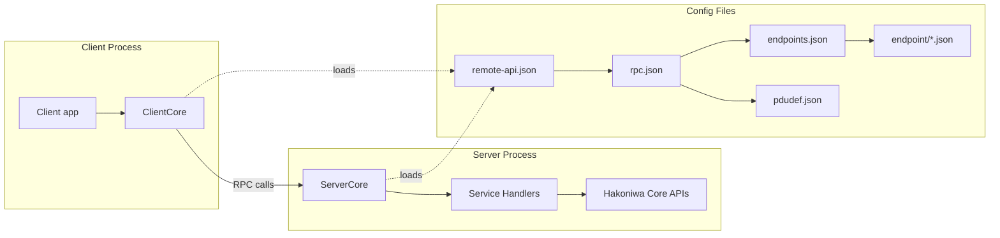

# hakoniwa-remote-api
Transport-agnostic remote API for operating Hakoniwa worlds, assets, and runtimes from external processes.

## Architecture

The Remote API exposes a small RPC surface area that clients use to join a Hakoniwa simulation, query state, control the simulation, and acknowledge events. Configuration is provided via `remote-api.json`, which points to the RPC service definition, endpoints configuration, and poll timing.



## RPC API specification (5 services)

All RPC services are declared in `config/sample/rpc/rpc.json` and implemented by the server handlers in `src/server/concrete_service_handler.cpp`.

| Service | Purpose | Request | Response |
| --- | --- | --- | --- |
| `HakoRemoteApi/Join` | Register a client with the server. | `name` (client node ID) | `status_code`, `message` |
| `HakoRemoteApi/GetSimState` | Retrieve the current simulation state. | `name` (client node ID) | `sim_state`, `master_time`, `is_pdu_created`, `is_simulation_mode`, `is_pdu_sync_mode` |
| `HakoRemoteApi/SimControl` | Start/stop/reset the simulation. | `name`, `op` (`HakoSimulationControlCommand`) | `status_code`, `message` |
| `HakoRemoteApi/GetEvent` | Get the next pending event for the client. | `name` | `event_code` |
| `HakoRemoteApi/AckEvent` | Acknowledge an event after handling. | `name`, `event_code`, `result_code` | (no body status; see below) |

### RPC result codes

Responses use `hakoniwa::pdu::rpc::HAKO_SERVICE_RESULT_CODE_*` to report success, invalid requests, or internal errors. `AckEvent` does not set a status in its response body; clients should rely on the RPC header result code. The server validates the client name before processing requests.

## Server API specification

The server-facing public API is exposed via `hakoniwa::api::ServerCore`.

- `ServerCore(std::string config_path, std::string node_id, bool enable_conductor = false)`
  - Loads configuration from `remote-api.json` and binds to the specified server node ID.
- `bool initialize(std::shared_ptr<hakoniwa::pdu::EndpointContainer> endpoint_container)`
  - Parses configuration, validates server/client pairing, and registers service handlers.
- `bool initialize_rpc_services()`
  - Initializes RPC services after `initialize(...)` has been called.
- `bool start()`
  - Starts RPC services and spawns worker threads.
- `bool stop()`
  - Stops RPC services and joins worker threads (idempotent).
- `bool is_running() const`
  - Reports whether the server is running.
- `std::string last_error() const`
  - Returns the last error message.

## Client API specification

The client-facing public API is exposed via `hakoniwa::api::ClientCore`.

- `ClientCore(std::string node_id, std::string config_path)`
  - Loads configuration and binds to the specified client node ID.
- `bool initialize(std::shared_ptr<hakoniwa::pdu::EndpointContainer> endpoint_container)`
  - Parses configuration and initializes the RPC client.
- `bool start()` / `bool stop()`
  - Starts or stops RPC services.
- `bool is_pdu_end_point_running()`
  - Returns whether the client endpoint is available.
- `bool join()`
  - Calls `HakoRemoteApi/Join`.
- `bool get_sim_state(HakoSimulationStateInfo &state)`
  - Calls `HakoRemoteApi/GetSimState`.
- `bool sim_control(HakoSimulationControlCommand command)`
  - Calls `HakoRemoteApi/SimControl`.
- `bool get_event(HakoSimulationAssetEvent &event)`
  - Calls `HakoRemoteApi/GetEvent`.
- `bool ack_event(HakoSimulationAssetEvent event)`
  - Calls `HakoRemoteApi/AckEvent`.
- `std::string last_error() const`
  - Returns the last error message.

## Build instructions

### Prerequisites

- C++20 toolchain
- CMake 3.10+
- Hakoniwa runtime libraries and headers installed under `/usr/local/hakoniwa`
- `hakoniwa-pdu-rpc` submodule initialized
- Installed `hakoniwa-pdu-endpoint` (headers and library)

### Build

```bash
git submodule update --init --recursive
mkdir -p build
cd build
cmake ..
cmake --build .
```

The build generates the `hakoniwa_remote_api` library and sample `server`/`client` executables.

### Notes about hakoniwa-pdu-endpoint

`hakoniwa-pdu-endpoint` is no longer a submodule of `hakoniwa-pdu-rpc`. It must be installed separately (default prefix is `/usr/local/hakoniwa`).

If your install prefix is non-standard, pass it to CMake:

```bash
cmake -S . -B build -DHAKO_PDU_ENDPOINT_PREFIX=/path/to/prefix
```

Or specify include/library paths directly:

```bash
cmake -S . -B build \
  -DHAKO_PDU_ENDPOINT_INCLUDE_DIR=/path/to/include \
  -DHAKO_PDU_ENDPOINT_LIBRARY=/path/to/lib/libhakoniwa_pdu_endpoint.a
```

## Runtime flow (as implemented)

The sample executables wire up endpoints explicitly and then initialize the core APIs:

### Server flow

1. Create `EndpointContainer` with `<server_nodeId>` and `<endpoints.json>`.
2. `EndpointContainer::initialize()`
3. `ServerCore::initialize(endpoint_container)`
4. `EndpointContainer::start_all()`
5. `ServerCore::initialize_rpc_services()`
6. `ServerCore::start()`

### Client flow

1. Create `EndpointContainer` with `<client_nodeId>` and `<endpoints.json>`.
2. `EndpointContainer::initialize()`
3. `ClientCore::initialize(endpoint_container)`
4. `EndpointContainer::start_all()`
5. `ClientCore::start()`

Note: `ServerCore::start()` requires `initialize_rpc_services()` to have been called. If you are using the sample `src/main/server.cpp` as-is and see "Server is not properly initialized.", add a call to `server.initialize_rpc_services()` before `server.start()`.

## Configuration overview

- `config/sample/remote-api.json` defines server nodes, participants, time source, poll sleep timing, and points to `rpc.json` and `endpoints.json`.
  - `poll_sleep_time_usec`: server-side poll sleep interval.
  - `time_source_type`: time source for server polling (e.g., `real`).
  - `participants[].poll_sleep_time_usec`: client-side poll sleep interval.
- `config/sample/rpc/rpc.json` defines the 5 RPC services and references `endpoints.json` via `endpoints_config_path`. The legacy `endpoints` field is not used.
- `config/sample/rpc/endpoints.json` maps node IDs to endpoint config files.
- `config/sample/endpoint/*.json` configures transports, caches, and PDU definitions.
- `config/sample/pdudef/pdudef.json` defines PDU types and sizes.

## Design policies

- **Transport-agnostic RPC:** The RPC layer is configured via JSON and is not tied to a single transport implementation.
- **Small, explicit API surface:** The Remote API focuses on 5 core operations that cover join, state query, simulation control, and event handling.
- **Configuration-driven wiring:** Endpoints, channels, node IDs, and poll timing are declared in configuration files; RPC endpoint implementation names are currently fixed in code.
- **Strict validation:** Configuration is validated via schemas and a cross-file linter to catch inconsistencies early.

## Configuration validation utilities

### Validation

Use the repo-level linter for `remote-api.json`, and the RPC validator for `rpc.json`:

- `tools/config_lint.py` checks `remote-api.json` structure and referenced `rpc_service_config_path` existence.
- `tools/config_lint.py` also cross-checks participant `nodeId` entries against the `rpc.json` endpoints list.
- `hakoniwa-pdu-rpc/tools/validate_configs.py` validates RPC configs, endpoints, and endpoint schemas, and checks RPC semantics
  (e.g., unique names, channel collisions, maxClients constraints).

## Sample run (from repo root)

These commands use the sample configs shipped in this repository.

### Build

```bash
git submodule update --init --recursive
mkdir -p build
cd build
cmake ..
cmake --build .
```

### Start server

```bash
./server ../config/sample/remote-api.json node0-1 ../config/sample/rpc/endpoints.json
```

If the server exits with "Server is not properly initialized.", update `src/main/server.cpp` to call `server.initialize_rpc_services()` before `server.start()`, rebuild, and retry.

### Start client

```bash
./client ../config/sample/remote-api.json node1 ../config/sample/rpc/endpoints.json
```

### Client commands

Once the client is running, type one of the following commands and press Enter:

- `join` (register with server)
- `state` (read simulation state)
- `g:event` (get next event)
- `c:start` / `c:stop` / `c:reset` (simulation control)
- `a:start` / `a:stop` / `a:reset` (ack event)
- `q` / `quit` / `exit` (quit)

### `update_pdusize.py`

このユーティリティは、PDUサイズ定義ファイルに基づいて `rpc.json` 設定ファイル内の `pduSize` フィールドを自動的に更新します。これにより、RPCサービス設定が常に正しいPDUサイズを反映し、手動エラーを防ぎ、更新プロセスを効率化します。

**使用方法:**

```bash
python3 tools/update_pdusize.py <path_to_rpc_json> <path_to_pdu_size_dir>
```

- `<path_to_rpc_json>`: `rpc.json` ファイルへのパス (例: `config/sample/rpc/rpc.json`)。
- `<path_to_pdu_size_dir>`: PDUサイズ定義ファイルが配置されているルートディレクトリ (例: `messages/impl/pdu_size`)。

**例:**

```bash
python3 tools/update_pdusize.py config/sample/rpc/rpc.json messages/impl/pdu_size
```
